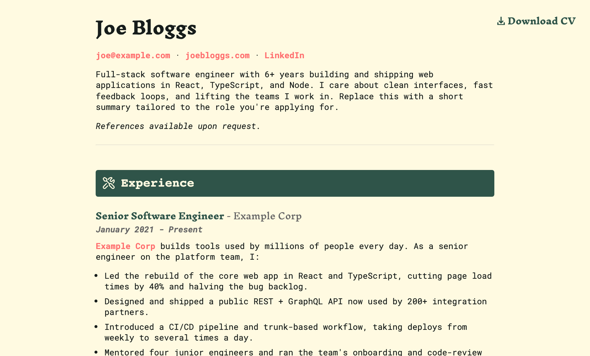

# cv-maker

[](https://github.com/mcclowes/cv-maker/actions/workflows/ci.yml)
[](https://github.com/mcclowes/cv-maker/actions/workflows/spellcheck.yml)

Write your CV in Markdown; get a styled, print-ready **PDF**, a responsive **web
page**, and a Markdown **README** out the other end. One source of truth, many
outputs — and a tidy way to keep role-specific variants without copy-pasting.

> This repo ships with a fictional **Joe Bloggs** CV as a worked example.
> Fork it, swap in your own details, and build.



## How it works

```
src/cvs/main.md ──┐
                  │  resolve {{> partials}}  →  one Markdown doc
src/sections/* ───┘                              │
                                                 ▼
                                    marked → HTML  →  Playwright → PDF
                                                 │
                              index.html / debug.html / (optional README.md)
```

Each CV is a single **main file** in `src/cvs/` that composes shared **sections**
from `src/sections/` using Handlebars-style partials (`{{> header/main }}`). The
engine resolves the partials, renders Markdown to HTML, applies your chosen
stylesheet(s), and prints a PDF with Playwright.

## Quick start

**Prerequisites:** [Node.js 20](https://nodejs.org/) (`nvm use` to match `.nvmrc`)
and the Playwright Chromium browser.

```bash
npm install
npx playwright install chromium   # one-time, needed for PDF generation
npm run build
```

This builds the primary variant and writes:

| File | What it is |
|------|------------|
| `joebloggs_cv.pdf` | Print-ready PDF (the canonical output) |
| `index.html` | Self-contained responsive web version |
| `debug.html` | HTML with visible page boundaries, for tweaking layout |

The output base name (`joebloggs_cv`) comes from `outputName` in `cv.config.js`.

## Make it yours

1. **Your details** — edit `cv.config.js` (`meta`: name, email, URL, etc.) and
   the section files under `src/sections/` (header, introduction, experience,
   skills, education, awards, about me).
2. **Compose the CV** — `src/cvs/main.md` decides which sections appear and in
   what order. Add, remove, or reorder the `{{> ... }}` partials.
3. **Build** — `npm run build`, then open `index.html` or the PDF.

`src/sections/_template.md` is a full reference for the available formatting,
CSS classes, page breaks, icons, and entry formats. Start there when writing
content.

### Role-specific variants

Define more variants in the `cvs` object in `cv.config.js`. A general-purpose
variant is just a main file in `src/cvs/`. A variant tailored to a specific job
lives in `src/applications/<name>/` and keeps everything for that application
together:

- `cv.md` — the tailored CV (the only file that gets built)
- `jd.md` — the source job description (reference only, never rendered)
- `cover-letter.md` — your cover letter draft (reference only)

See `src/applications/example/` for a worked example. Build a specific variant
by passing its key:

```bash
npm run build -- example
```

Non-primary variants write `joebloggs_cv_<variant>.pdf` and never overwrite the
primary's `index.html` / `README.md`.

### Styles

Two stylesheets ship in `src/styles/`: `cv` (default) and `newspaper`. Choose
per variant via `style: ["cv", "newspaper"]` in its `overrides`. Edit the CSS or
add your own stylesheet and reference it by filename.

### Render your CV into the repo README (optional)

By default `npm run build` does **not** touch `README.md` (so this documentation
is safe). If you want your CV to render into the README — handy for a
`github.com/<you>/<you>` profile repo — set `readme: true` in the primary
variant's `overrides`.

## Development

```bash
npm run watch         # rebuild on every change under src/
npm test              # run the Jest test suite
npm run lint          # ESLint
npm run spellcheck    # cspell over CV markdown (add words to cspell.config.json)
npm run validate      # lint + test
```

CI (`.github/workflows/ci.yml`) runs lint, spellcheck, tests with coverage, a
security audit, and a full build on every push and PR.

## Deploying

`index.html` is fully self-contained (inlined CSS), so any static host works —
drop it on **Vercel**, **Netlify**, or **GitHub Pages**. Point `downloadLink` in
`cv.config.js` at wherever you publish the PDF to wire up the web download button.

## Project layout

```
cv.config.js              # who you are + which variants to build
src/
  createCV.js             # entry point / CLI
  cvs/                    # main files (one per general-purpose variant)
  applications/           # role-specific variants (cv.md + jd.md + cover-letter.md)
  sections/               # reusable content partials + icons + _template.md
  styles/                 # cv.css, newspaper.css
  linkedin.md             # plain-text LinkedIn profile source (not built)
  generate/               # the HTML + PDF engine
```

## Acknowledgements

A Markdown-first CV builder. Originally a simple Markdown-to-PDF script, now a
small composable engine. Contributions and forks welcome.
